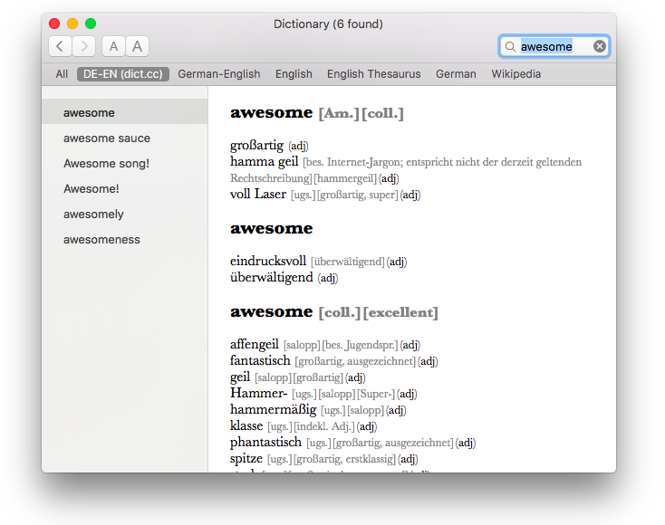

# dict.cc Dictionary Generator for MacOS

 
This is a Python script to create a MacOS (OS X) dictionary from dict.cc word lists. The generated dictionary is a regular dictionary for the MacOS stock Dictionary app, which means you can also look up words using Sportlight or anywhere via 3-Finger-Tap.

 
 
The dictionary itself can be downloaded from (Link)

 
 
Currently the following languages are available (built in May 2017):

- German - English
- German - Spanish
- German - French
- German - Icelandic
- German - Italian
- German - Swedish
- German - Russian
- German - Portugese

 
 

## Installation

Download a dictionary or build one by yourself (build instructions see below). 
Double click the dictionary (.pkg) and follow the installer 
Open the Dictionary app 
Go to Preferences 
Activate the dictionary by checking the checkbox (the new dictionary will be at the bottom of the list)

 
 

## Build Instructions

Get dict.cc word list 
http://www1.dict.cc/translation_file_request.php 
copy to project root 
rename to "de-en.txt" for example 

Apple Dictionary Developer Kit 
https://developer.apple.com/download/more/ 
"Additional Tools for Xcode 8.2" 
open .dmg 
Utilities/Dictionary Development Kit 
copy to /Developer/Extras/Dictionary Development Kit 

Run Python build script (written in Python 2) 
for example: python createpackages.py -d de-en.txt DE-EN "Deutsch-Englisch (dict.cc)"

3. Download dict.cc's database(s) in UTF-8 encoding and place it in the
   dictcc-dictionary-distrib directory.
   You only need one database for each language pair (e.g. DE-EN, EN-DE is not
   required).
4. Open a Terminal and "cd" to the dictcc-dictionary-distrib directory.
5. Launch the build script:
   user$ ./createpackages.py $filename $short $long
   Where $filename is the filename of the downloaded database, $shortname
   is the short name of your dictionary (e.g. "DE-EN"), and $longname is the
   long form of your dictionary's name (e.g. "Deutsch Englisch").
   
   user$ ./createpackages.py -dx DE-EN.txt DE-EN "Deutsch Englisch"
   
   There are some flags that toggle debug output (-d) or generate only a
   minimal subset of the dictionary (-x).
6. After some minutes or hours the dictionary can be found in
   ./objects/$longname.
   It can be installed by moving it into /Library/Dictionaries or
   /Users/$username/Library/Dictionaries/
7. Start/restart Dictionary.App.
8. Keep in mind that the license of dict.cc prohibits the distribution of the
   dict.cc database. Thus you are not allowed to distribute your dictionary.

 

## Project Credits

Bernhard Caspar 
&nbsp;&nbsp;&nbsp;&nbsp;&nbsp;&nbsp;https://www.bernhardcaspar.de/dictcc

Philipp Brauner/Lipflip 
&nbsp;&nbsp;&nbsp;&nbsp;&nbsp;&nbsp;https://lipflip.org/articles/dictcc-dictionary-plugin 
&nbsp;&nbsp;&nbsp;&nbsp;&nbsp;&nbsp;https://lipflip.org/node/2096
   
Wolfgang Reszel 
&nbsp;&nbsp;&nbsp;&nbsp;&nbsp;&nbsp;http://www.tekl.de/deutsch/Lexikon-Plugins.html
   

	
## License
This project is released under GPL license

