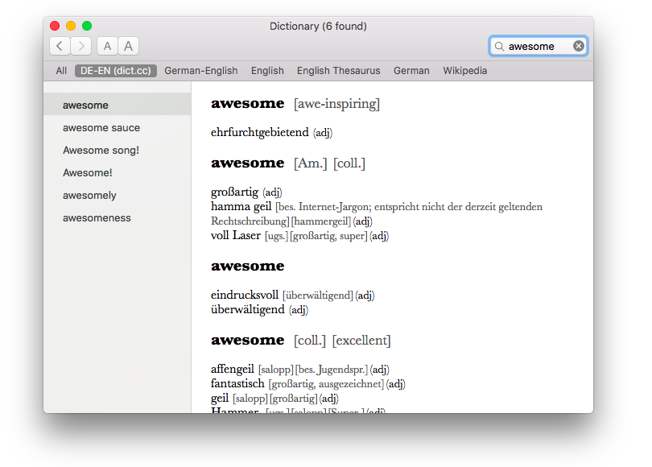

# dict.cc Dictionary Generator for MacOS

 
This is a Python script to create a MacOS (OS X) dictionary from dict.cc word lists. The generated dictionary is a regular dictionary for the MacOS stock Dictionary app, which means you can also look up words using Sportlight or anywhere via 3-Finger-Tap.

 
 
The dictionary itself can be downloaded from (Link)

 
 
Currently the following languages are available (built in May 2017):

- German - English
- German - Spanish
- German - French
- German - Icelandic
- German - Italian
- German - Swedish
- German - Russian
- German - Portugese

 
 

## Installation

Download a dictionary or build one by yourself (build instructions see below). 
Double click the dictionary (.pkg) and follow the installer 
Open the Dictionary app 
Go to Preferences 
Activate the dictionary by checking the checkbox (the new dictionary will be at the bottom of the list)

 
 

## Build Instructions

Get dict.cc word list 
http://www1.dict.cc/translation_file_request.php 
copy to project root 
rename to "de-en.txt" for example 

Apple Dictionary Developer Kit 
https://developer.apple.com/download/more/ 
"Additional Tools for Xcode 8.2" 
open .dmg 
Utilities/Dictionary Development Kit 
copy to /Developer/Extras/Dictionary Development Kit 

Run Python build script (written in Python 2) 
for example: python createpackages.py -d de-en.txt DE-EN "Deutsch-Englisch (dict.cc)"

 

## Project Credits

Bernhard Caspar 
&nbsp;&nbsp;&nbsp;&nbsp;&nbsp;&nbsp;https://github.com/bernhardc/dictcc-macos-dictionary

Philipp Brauner/Lipflip 
&nbsp;&nbsp;&nbsp;&nbsp;&nbsp;&nbsp;https://lipflip.org/articles/dictcc-dictionary-plugin 
&nbsp;&nbsp;&nbsp;&nbsp;&nbsp;&nbsp;https://lipflip.org/node/2096
   
Wolfgang Reszel 
&nbsp;&nbsp;&nbsp;&nbsp;&nbsp;&nbsp;http://www.tekl.de/deutsch/Lexikon-Plugins.html
   

	
## License
This project is released under GPL license

